# CPU

This script is part of the Cyberplanning project. It takes place as the backend updater for the Mongo database.

Let's call it **CPU**, for **CyberPlanning Updater**.

The goal is to update at a given frequence the database used by the API to provide the courses to the end-user.

Although Cyberplanning was first designed as a planning for students at first, this updater and the database are not restricted to such a use case. The semantics for these imply to split the courses or other events into a branch, inside of which they will have different affiliations to link them to our defined groups. Read more about it in the **Database architecture** section, or in **Configuration**.

## How it works

CPU has different states according to its configuration (see dedicated part below).



[Mermaid View](https://mermaidjs.github.io/mermaid-live-editor/#/view/eyJjb2RlIjoic3RhdGVEaWFncmFtXG5zdGF0ZSBVcGRhdGUge1xuc3RhdGUgQnJhbmNoIHtcblsqXSAtLT4gRG93bmxvYWRpbmdcbkRvd25sb2FkaW5nIC0tPiBEb3dubG9hZGluZyA6IEZhaWx1cmVcbkRvd25sb2FkaW5nIC0tPiBbKl0gOiBUb28gbWFueSBmYWlsdXJlc1xuRG93bmxvYWRpbmcgLS0-IFBhcnNpbmcgOiBTdWNjZXNzXG5QYXJzaW5nIC0tPiBVcGRhdGluZ1xuVXBkYXRpbmcgLS0-IFsqXVxufVxuWypdIC0tPiBCcmFuY2hcbkJyYW5jaCAtLT4gQnJhbmNoOiBOZXh0IGJyYW5jaFxuQnJhbmNoIC0tPiBbKl0gOiBObyBtb3JlIGJyYW5jaFxufVxuWypdIC0tPiBVcGRhdGVcblVwZGF0ZSAtLT4gSWRsZVxuSWRsZSAtLT4gVXBkYXRlOiBEZWxheSIsIm1lcm1haWQiOnsidGhlbWUiOiJkZWZhdWx0In19)

- **Downloading**: downloads the given URLs for every groups in the current branch. After a certain amount of failed attempts, it hibernates in idle mode. In case of success, it goes through parsing.
- **Parsing**: parses the iCal previously downloaded. It has custom modes adapted to our needs and situation, read more in the dedicated part below. Parsing also format the events for every groups according to the database for the next part, updating.
- **Updating**: updates the database for the current branch, differenciating unchanged events, new events, updated events and deleted events.
- **Idle**: waits a certain amount of time for the next update.

### About Parsing

The iCal format is used differently by different services and people creating events. The issue is that some of these don't use the standard way to describe their events. That's why we defined 2 modes adapted to our current needs for Cyberplanning:

- **ENT**: our school planning. The provider is ADE, and the people creating and modifying their events are multiple (school administratives, teachers, ...).
- **Hack2G2**: an association planning. The provider is Nextcloud, and one person is creating and modifying their own events (the head or secretary).

In ENT mode, the provider ADE gives teachers and groups in the "DESCRIPTION" field of the iCal format, for every events. So the parsing of such event must be based on regular expressions, to identify our own database fields "teachers", "groups" and "undetermined_description_items".

In Hack2G2 mode, the provider Nextloud also uses the iCal "DESCRIPTION" field for participants (our "teachers"), but uses the iCal field "CLASS" for our "groups" database field. The parsing is more standard for groups, but teachers still need regular expression parsing according to the habits of the person updating their events.

See more about Regex configuration in the **Configuration** section.

If you are willing to re-use this updater and database, these modes are most likely not appropriate for your needs and a new `EventParser`-inheriting class must be written.

## Configuration

Parameters can be set in `params.json`. This file's scope is defined in the *JSON schema* `params.schema.json`, with a description for each node or element. It needs to be created first as we do not provide a ready-to-go file in this repo.

Still, here is an example *JSON instance* to base your `params.json` file on:

```json
{
  "updater": {
    "frequency": 600,
    "error_tolerance": 5
  },
  "database": {
    "name": "planning",
    "host": "mongo",
    "port": 27017
  },
  "branches": [
    {
      "name": "cyber",
      "parser": {
        "mode": "ENT",
        "teachers_patterns": [
          "^[A-Za-zàâäéèêëìîïòôöùûüÿ\\s\\.\\-]+$"
        ],
        "groups_patterns": [
          "^(Group|GROUP)[1-6]([ -](SUB|Sub|sub)[1234])?$"
        ],
        "blacklist": [
          "\\n"
        ],
        "delimiter": "\n"
      },
      "groups": [
        {
          "name": "1",
          "addresses": [
            ""
          ]
        },
        {
          "name": "2",
          "addresses": [
            ""
          ]
        }
      ]
    },
    {
      "name": "hack2g2",
      "parser": {
        "mode": "Hack2G2"
      },
      "groups": [
        {
          "name": "42",
          "addresses": [
            "https://drive.hack2g2.fr/remote.php/dav/public-calendars/2H0SEVYL4SEWNHYC?export"
          ]
        }
      ]
    }
  ]
}
```

- **updater** contains general parameters about CPU.
  - **frequency** is the idling time for CPU, after an update.
  - **error_tolerance** is the number of consecutive unexpected errors that are allowed during an update, when such an error is thrown the script transitates to idle state, or the script breaks if the X last updates ended with errors and X exceeds **error_tolerance**.
- **database** contains parameters to link to the Mongo service offering the database.
  - **name** is the name of the database to use in Mongo.
  - **host** is the domain name or the IP address for the Mongo service (default is `127.0.0.1`).
  - **port** is the port on which the Mongo service works (default is `27017`).
- **branches** contains parameters for every different branches, composed of many groups, to store in the database.
  - **name** is the name of the branch (represented as `XXXX` below), used to identify collections in the Mongo database.
  - **parser** is a set of parameters giving the **mode** of parsing and describing various possible patterns you can influence in (in ENT mode currently) for the branch groups.
  - **groups** is a list containing every groups represented with their **name** (*affiliation* in the database) and their **adresses** linking to their downloadable iCal.

## Database architecture

In the Mongo database, you can find two collections per branch, `XXXX` being the branch name:
- `planning_XXXX` as the set of events / courses existing of the branch
- `garbage_XXXX` as the set of events / courses which are not found (removed or event ID changed) anymore in further updates

A BSON document in a `planning_XXXX` or `garbage_XXXX` collection looks like:

```js
{
  "_id": ObjectId("0123456789abcdef01234567"),
  "event_id": "ADE60123456789abcdef0123456789abcdef01234",
  "affiliation" : [
    "21",
    "22"
  ],
  "classrooms" : [
    "V-TO-ENSIbs-A001,V-TO-ENSIbs-A002"
  ],
  "end_date" : ISODate("2018-01-31T09:30:00Z"),
  "groups" : [
    "CYBER S3",
    "CYBER S4"
  ],
  "start_date" : ISODate("2018-01-31T07:30:00Z"),
  "teachers" : [
    "McAfee J."
  ],
  "title" : "CTF challenge",
  "undetermined_description_items" : [ ],
  "last_update" : ISODate("2018-01-31T23:56:35.838Z"),
  "old" : [
    {
      "undetermined_description_items" : [
        "xYZ"
      ],
      "updated" : ISODate("2018-01-31T20:34:57.261Z")
    }
  ]
}
```

- **\_id** is the normal identifier given by Mongo at the document creation, used by the script to update, delete or move documents through both collections.
- **event_id** is an identifier found in the iCal, provided by the remote service, to follow and keep each event through updates, with this CPU knows if the event is new, was updated or unchanged, or if it doesn't exist anymore.
- **affiliation** is the list of groups linked to the parameters (in group *name*) to ensure the source of the event: it comes from at least 1 group. Please note it is different from the **groups** list, which comes from parsing.
- **title** is the event short description identified after parsing.
- **classrooms** is the list of places where the event take place, identified on parsing.
- **groups** is the list of groups identified on parsing the iCal, it is not the same as **affiliation** list, which comes from your configuration.
- **teachers** is the list of participants identified on parsing.
- **start_date** is the datetime of the start of the event in UTC.
- **end_date** is the datetime of the end of the event in UTC.
- **undetermined_description_items** is the list of items seen but undetermined during parsing.
- **last_update** is the datetime of the last update during which the event was either created, modified, unchanged or moved to the garbage collection.
- **old** is the list of modified elements for history and traceability purpose: it may holds multiple objects in which you find 1 or many of the changed elements (in the example **undetermined_description_items**) at one datetime, which is also stored in the object at **updated**. So when an event is modified and CPU detects it in an update cycle, it copies the changed data in **old** to keep track of the changes, then modifies the values in the root of the event document.

## Setting up CPU

### Using Docker

You can setup the updater easily using Docker. You will require first a Mongo service running and the `params.json` configured accordingly.

Here is a sample docker-compose descriptor:

```yml
version: '3'

services:
  updater:
    build: PlanningUpdater
    image: cpu:latest
    environment:
      - "PYTHONUNBUFFERED=1"
    links:
      - mongo
    depends_on:
      - mongo

  mongo:
    image: mongo:4
    ports:
      - "127.0.0.1:3001:3001"
    volumes:
      - "./Mongo:/data/db"
```

Note: env variable `PYTHONUNBUFFERED=1` is used to allow logs to be printed through standard out, when you use:

```shell
docker-compose logs updater
```

To launch with Docker Compose, use:

```shell
docker-compose up -d
```

### Normal

For a normal installation, you must first setup a [Mongo](https://resources.mongodb.com/getting-started-with-mongodb) service, then set your configuration in `params.json` after cloning this repo.

Python 3 is required, and thses dependencies:

```shell
apt-get install python-pip
python -m pip install --upgrade pip
python -m pip install -r requirements.txt
```

To launch the updater, use:

```
python ./cpu.py
```

If logs don't show off, set the environment variable `PYTHONUNBUFFERED` to `1`.
